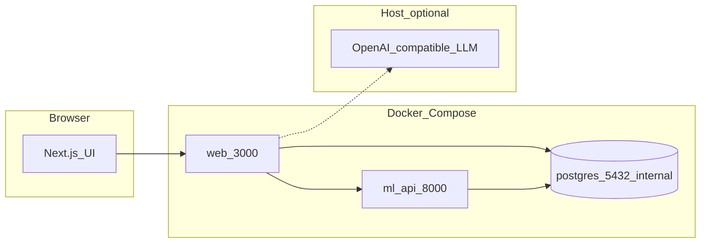

# System architecture

This document describes the **oracleeyes** repository layout: how the web app, ML API, database, and optional host integrations connect.

## System overview



### Responsibilities

- **Browser** loads the Next.js UI. In-browser code may call **`NEXT_PUBLIC_ML_API_URL`** (typically `http://localhost:8000`) for ML operations from the client.
- **`web` container** runs the Next.js server. Server code uses **`ML_API_URL`** (e.g. `http://ml-api:8000` on the Compose network) and **`DATABASE_URL`** for Postgres.
- **`ml-api`** exposes train, predict, backtest, ingest, and optional Kronos / Oracle forecast routes. May use **GPU** when enabled in Compose.
- **Postgres** stores **`agent_memory`** (see repository root `init.sql`) for assistant continuity when configured.
- **Host or sidecar LLM** — `LOCAL_LLM_BASE_URL` (Compose defaults use `host.docker.internal` when the inference server listens on the Docker host) powers **`POST /api/chat`**.

## Run the full stack (Docker Compose)

`docker-compose.yml` defines three services: **`postgres`**, **`ml-api`**, **`web`**. Start them from the **repository root** (next to `docker-compose.yml`):

```bash
cp .env.example .env
# Edit .env for LOCAL_LLM_* and any optional keys
docker compose up -d --build
```

| Service | Role | Published port (default) |
|---------|------|---------------------------|
| `postgres` | Database for `agent_memory` etc. | Internal only (see compose comments) |
| `ml-api` | FastAPI train / predict / backtest / forecasts | **8000** → host |
| `web` | Next.js production server | **3000** → host |

Inside the Compose network, **`web`** reaches **`ml-api`** at `http://ml-api:8000` (`ML_API_URL`) and **`postgres`** at `postgres:5432` (`DATABASE_URL`). The browser uses **`NEXT_PUBLIC_ML_API_URL`** (set at **image build** time, usually `http://localhost:8000`) to call the ML API from the client.

Useful commands:

```bash
docker compose ps
docker compose logs -f web
docker compose exec postgres psql -U oracleeyes -d oracleeyes
```

## Repository layout

| Path | Role |
|------|------|
| `apps/web/` | Next.js 16 App Router: dashboard, APIs under `src/app/api` |
| `services/ml-api/` | FastAPI: ingest, train, predict, backtest, forecasts |
| `docker-compose.yml` | `postgres`, `ml-api`, `web` |
| `init.sql` | Postgres init: `agent_memory` |
| `docs/` | This documentation set (see **docs/README.md**) |

## Data and configuration (summary)

- **CSV** — Parsed in the browser (`parse-csv.ts`) and/or via ML ingest; MT5-style filenames are handled in `mt5-filename.ts`.
- **Environment** — Root `.env` and `apps/web/.env` (templates: `.env.example`). See **OE-DOC-006**.

## Conventions for changes

1. **Server vs client** — Secrets, `fs`, and DB drivers stay in **`app/api`** or server-only modules.
2. **ML contract** — If you change FastAPI schemas, update **`apps/web/src/lib/ml-api.ts`** and all callers (predict panel, chat tools).
3. **Copy** — Prefer **`apps/web/src/lib/product-copy.ts`** for user-visible strings.

## Related documents

| ID | Topic |
|----|--------|
| OE-DOC-003 | Next.js app structure and flows |
| OE-DOC-005 | API summary tables |
| OE-DOC-006 | Environment variables |
