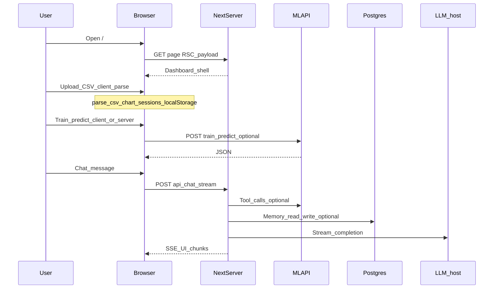
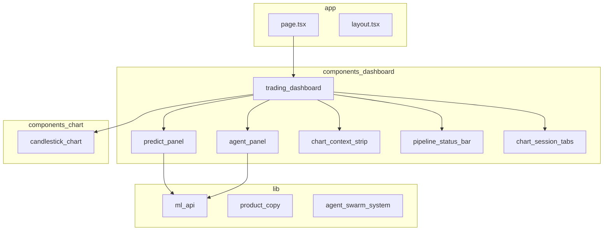

# Next.js application architecture

This document describes the **OracleEyes web app** (`apps/web`): App Router entrypoints, folder responsibilities, and how requests and state move through the system.

## Technology baseline

- **Next.js 16** (App Router), **React 19**, **TypeScript**.
- **Output:** `standalone` (see `apps/web/next.config.ts`) for Docker-friendly production images.

## High-level request flow



## App Router file tree (conceptual)

```text
apps/web/src/app/
├── layout.tsx              # Root layout, providers, viewport chrome
├── page.tsx                # Home: TradingDashboard (client)
├── globals.css             # Design tokens, oracle-tv chrome variables
├── error.tsx / global-error.tsx
└── api/
    ├── chat/route.ts       # Streaming assistant + tools + memory
    ├── setup-status/route.ts
    └── market/
        ├── symbols/route.ts
        └── ohlc/route.ts
```

**Redirects** (not separate `page.tsx` routes) are declared in **`next.config.ts`**:

| Source | Destination |
|--------|----------------|
| `/predict` | `/` |
| `/agents` | `/?tab=agents` |

## Component and library layout



| Path under `src/` | Responsibility |
|-------------------|------------------|
| `app/` | Routing, layouts, Route Handlers (`api/*/route.ts`) |
| `components/dashboard/` | Trading shell: tabs, chart column, workspace, ML & agents |
| `components/chart/` | Candlestick + overlays |
| `components/ui/` | Shared primitives (shadcn-style) |
| `lib/ml-api.ts` | Typed client for FastAPI |
| `lib/product-copy.ts` | User-visible strings |
| `lib/agent-swarm-system.ts` | Assistant system / depth behavior |
| `hooks/use-chart-sessions.ts` | Persisted chart tabs (localStorage) |
| `types/` | Shared TS types (`market`, `workspace-tab`) |

## Server vs client boundary

| Concern | Runs where |
|---------|------------|
| CSV parse for instant preview | Client (`"use client"` dashboard) |
| `POST /api/chat` | Server only |
| Calls to `ML_API_URL` from Route Handlers | Server |
| Calls to `NEXT_PUBLIC_ML_API_URL` from browser | Client (same-origin or CORS per ML API config) |

## Related documents

| ID | Topic |
|----|--------|
| OE-DOC-002 | Full stack including ML API and Postgres |
| OE-DOC-005 | API path summary |
| OE-DOC-008 | Naming and glossary |
