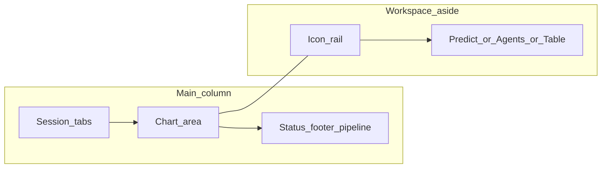

# User journeys and workspace

## Primary journeys

### 1. Load data and explore

1. User opens `/` (dashboard).
2. User uploads CSV (or opens a saved session tab).
3. Chart renders with optional volume / moving-average overlays.
4. **Chart context strip** shows bar count, symbol/timeframe badges (when metadata exists), and expandable “About this window” / return windows.

### 2. Run the number pipeline

1. User opens workspace rail → **ML & forecast**.
2. User trains a model (minimum bar count enforced by ML API), runs predict and/or backtest.
3. Optional: **Forecast on chart** draws violet scenario candles; chart and assistant context stay aligned with the same bar series.

### 3. Discuss with the assistant

1. User opens workspace rail → **Agent swarm**.
2. User sends messages; server streams responses.
3. When LLM and tools are configured, the model may call train/predict/backtest or chart snapshot tools against the **currently loaded** series.

### 4. Inspect raw data

1. User opens workspace rail → **OHLC table** for a scrollable preview of loaded bars.

## Workspace model

- **Session tabs** — Multiple saved snapshots plus optional “unsaved” in-memory chart.
- **Workspace** — Collapsible; vertical icon rail on large screens, horizontal on small screens.
- **Pipeline strip** (footer) — Lightweight checklist: data volume, train, predict, backtest, swarm visited.

## Related documents

| ID | Topic |
|----|--------|
| OE-DOC-003 | Next.js structure |
| OE-DOC-007 | FAQ |
